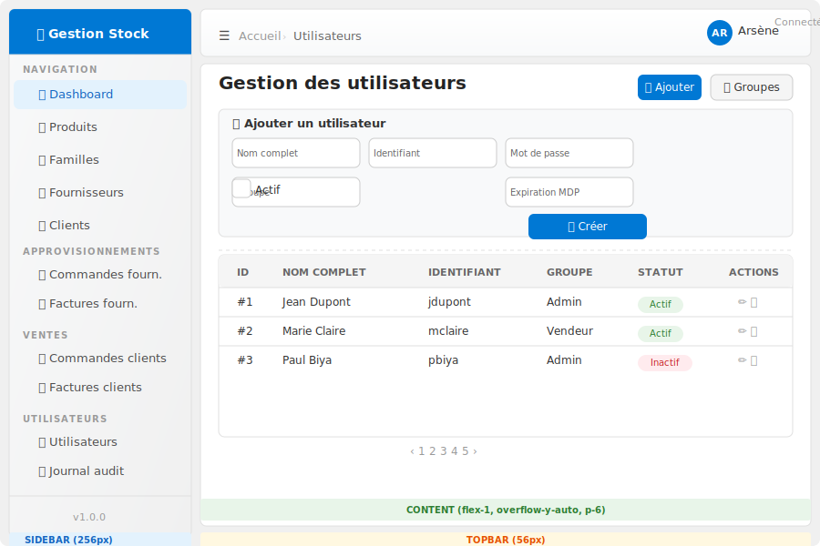

# Design System — Gestion de Stock

## Architecture de l'AppShell



L'application est structurée en **3 zones** :

```
┌─────────────────────────────────────────────────────┐
│                    TOPBAR (56px)                     │
│  ☰  Accueil › Utilisateurs      👤 Arsène Connecté  │
├──────────┬──────────────────────────────────────────┤
│          │                                           │
│ SIDEBAR  │  CONTENT (scrollable)                     │
│ (256px)  │                                           │
│          │  ┌─ Page Header ───────────────────────┐  │
│ 📊 Tableau│  │ Gestion des utilisateurs  [+ Ajout] │  │
│   de bord │  └────────────────────────────────────┘  │
│          │                                           │
│ 🏷️ Produits│  ┌─ Card ──────────────────────────────┐  │
│ 📁 Familles│  │ Formulaire d'ajout                   │  │
│          │  └────────────────────────────────────┘  │
│ ...      │                                           │
│          │  ┌─ Table ──────────────────────────────┐  │
│ v1.0.0   │  │ ID │ Nom │ Login │ Groupe │ Statut   │  │
└──────────┴──────────────────────────────────────────┘
```

### Styles CSS associés (dans `public/css/main.css`)

| Zone | Classes | Rôle |
|------|---------|------|
| AppShell | `.appshell`, `.appshell-main`, `.appshell-content` | Structure racine flex |
| Sidebar | `.sidebar`, `.sidebar-header`, `.sidebar-nav`, `.sidebar-item`, `.sidebar-backdrop` | Navigation latérale |
| Topbar | `.topbar`, `.topbar-toggle`, `.topbar-breadcrumb`, `.topbar-user` | Barre d'outils supérieure |
| Content | `.page-header`, `.page-title`, `.page-actions` | En-tête de page |

> **Responsive mobile** : la sidebar se masque (`-translate-x-full`) et un backdrop apparaît. Un bouton burger (`data-sidebar-toggle`) permet de l'ouvrir/fermer.

---

## Guide des composants

Chaque développeur doit **uniquement utiliser les fonctions de `views/components/`** pour construire les écrans. Aucune classe Tailwind brute n'est autorisée dans les vues.

### 0. Loading States — `loading.php`

```php
renderSpinner($size, $color)
renderSkeletonText($lines, $width)
renderSkeletonCard()
renderLoadingOverlay($message)
renderInlineLoader($text)
```

**Exemples :**

```php
// Spinner pendant un chargement
<div class="text-center py-8">
    <?= renderSpinner('lg', 'brand') ?>
    <p class="text-caption text-neutral-50 mt-2">Chargement...</p>
</div>

// Skeleton pendant le chargement d'une liste
<?= renderSkeletonText(5) ?>

// Overlay fullscreen
<?= renderLoadingOverlay('Import en cours...') ?>
```

### 0.1. Recherche Globale — `search.php`

```php
renderGlobalSearch()
```

La recherche globale est automatiquement incluse dans la topbar. Pour personnaliser les résultats, modifier `api/search.php`.

**Raccourci clavier : Ctrl+K**

### 0.2. Breadcrumb — `appshell.php`

```php
renderBreadcrumb($items)
```

**Exemple :**

```php
$breadcrumb = renderBreadcrumb([
    ['label' => 'Accueil', 'href' => '?action=dashboard'],
    ['label' => 'Utilisateurs', 'href' => '?action=utilisateurs'],
    ['label' => 'Modifier'] // Dernier sans href
]);
```

### 0.3. Sidebar avec Badges — `appshell.php`

```php
renderSidebarItem($label, $icon, $href, $active, $badge)
renderCollapsibleSection($label, $items, $id, $defaultCollapsed)
```

**Exemples :**

```php
// Item avec badge
echo renderSidebarItem(
    'Commandes',
    'fa-shopping-cart',
    '?action=commandes',
    false,
    ['count' => 12, 'type' => 'warning']
);

// Section collapsible
echo renderCollapsibleSection('Structure', [
    ['label' => 'Produits', 'icon' => 'fa-tag', 'href' => '?action=produits'],
    ['label' => 'Familles', 'icon' => 'fa-folder', 'href' => '?action=familles'],
], 'structure');
```

### 1. Boutons — `button.php`

```php
renderButton($label, $type, $href, $attrs)
```

| Paramètre | Valeurs | Description |
|-----------|---------|-------------|
| `$label` | `string` | Texte du bouton |
| `$type` | `primary` `secondary` `danger` `success` `warning` `ghost` `icon` `icon-danger` | Variante visuelle |
| `$href` | `string|null` | URL (optionnel, si null → `<button>`) |
| `$attrs` | `array` | Attributs HTML + clés spéciales : `icon` (FontAwesome) |

**Exemples :**

```php
// Bouton primaire avec icône
renderButton('Nouveau produit', 'primary', '?action=produits&add', ['icon' => 'fa-plus']);

// Bouton secondaire (lien)
renderButton('Retour', 'secondary', '?action=dashboard');

// Bouton danger avec confirmation
renderButton('Supprimer', 'danger', '#', ['data-confirm' => 'Confirmer ?']);

// Bouton icône seule (pour les actions dans les tableaux)
renderButton('', 'icon', '#', ['icon' => 'fa-edit', 'title' => 'Modifier']);
```

### 2. Tableaux — `table.php`

```php
renderTable($headers, $rows, $actionRenderer, $emptyMessage)
```

| Paramètre | Type | Description |
|-----------|------|-------------|
| `$headers` | `string[]` | Noms des colonnes |
| `$rows` | `array[]` | Lignes (chaque ligne = tableau de cellules HTML) |
| `$actionRenderer` | `callable|null` | Fonction qui reçoit la ligne courante et retourne le HTML des actions |
| `$emptyMessage` | `string` | Message si aucune donnée |

**Exemple :**

```php
$rows = array_map(function($p) {
    return [
        '#' . $p['id'],
        htmlspecialchars($p['nom']),
        htmlspecialchars($p['famille']),
        '<strong>' . $p['stock'] . '</strong>',
        $p['actif'] ? renderBadge('Actif', 'success') : renderBadge('Inactif', 'danger'),
    ];
}, $produits);

echo renderTable(
    ['R\u00e9f', 'Nom', 'Famille', 'Stock', 'Statut'],
    $rows,
    fn($p) =>
        renderButton('', 'icon', "?action=produits&edit={$p['id']}", ['icon' => 'fa-edit', 'title' => 'Modifier']) .
        renderButton('', 'icon-danger', "?action=produits&delete={$p['id']}", ['icon' => 'fa-trash', 'title' => 'Supprimer', 'data-confirm' => 'true'])
);
```

**Structure d'une ligne :**

Chaque cellule doit être une **chaîne HTML**. Pour les données brutes, utilisez `htmlspecialchars()`. Pour les badges, boutons ou autres composants, appelez les fonctions render directement.

### 3. Formulaires — `form_input.php`

```php
renderInput($name, $label, $type, $value, $error, $attrs)
renderSelect($name, $label, $options, $selected, $error, $attrs)
renderTextarea($name, $label, $value, $error, $attrs)
renderCheckbox($name, $label, $checked, $attrs)
```

**Exemples :**

```php
// Champ texte
renderInput('nom', 'Nom du produit', 'text', $produit['nom'] ?? '');

// Champ avec erreur de validation
renderInput('prix', 'Prix', 'number', '', 'Le prix doit être supérieur à 0');

// Select avec options
renderSelect('id_famille', 'Famille', array_column($familles, 'nom', 'id'), $produit['id_famille'] ?? null);

// Champ avec attributs supplémentaires (placeholder, required, etc.)
renderInput('reference', 'Référence', 'text', '', null, ['placeholder' => 'Ex: PRD-001', 'required' => 'required']);

// Checkbox
renderCheckbox('actif', 'Produit actif', true);

// Textarea
renderTextarea('description', 'Description', $produit['description'] ?? '');
```

### 4. Alertes — `alert.php`

```php
renderAlert($message, $type, $dismissible)
renderFlashAlerts()
setFlash($message, $type)
```

| Type | Couleur | Usage |
|------|---------|-------|
| `success` | Vert | Opération réussie |
| `danger` | Rouge | Erreur / échec |
| `warning` | Orange | Attention |
| `info` | Bleu | Information |

**Exemple :**

```php
<?php if (!empty($message)): ?>
    <?= renderAlert($message, 'success') ?>
<?php endif; ?>
<?php if (!empty($error)): ?>
    <?= renderAlert($error, 'danger') ?>
<?php endif; ?>

// Ou via session flash :
// setFlash('Produit créé avec succès', 'success');
// Dans la vue : <?= renderFlashAlerts() ?>
```

### 5. Badges — `badge.php`

```php
renderBadge($label, $type)
```

| Type | Rendu |
|------|-------|
| `success` | 🟢 Vert |
| `danger` | 🔴 Rouge |
| `warning` | 🟡 Orange |
| `info` | 🔵 Bleu |
| `neutral` | ⚪ Gris |

**Exemple :**

```php
renderBadge('Actif', 'success');
renderBadge('Stock faible', 'danger');
renderBadge('En attente', 'warning');
```

### 6. Cartes — `card.php`

```php
renderCard($body, $title, $footer, $attrs)
```

**Exemple :**

```php
echo renderCard(
    '<p class="text-body text-neutral-30">Contenu de la carte ici...</p>',
    'Titre de la carte',
    '<button class="btn-primary">Enregistrer</button>'
);
```

### 7. Modals — `modal.php`

```php
renderModal($id, $title, $body, $footer, $size)
```

Les modals sont contrôlées par le JS via les attributs `data-modal-toggle` et `data-modal-close`.

**Exemple :**

```php
// Déclencher l'ouverture :
renderButton('Modifier', 'icon', '', [
    'icon' => 'fa-edit',
    'data-modal-toggle' => 'editModal'
]);

// Rendu du modal (généralement en bas de la vue) :
echo renderModal('editModal', 'Modifier le produit', '
    <form>
        ' . renderInput('nom', 'Nom') . '
        ' . renderInput('prix', 'Prix', 'number') . '
        <div class="modal-footer px-0 pb-0">
            <button type="button" class="btn-secondary" data-modal-close>Annuler</button>
            ' . renderButton('Enregistrer', 'primary', null, ['icon' => 'fa-save']) . '
        </div>
    </form>
');
```

### 8. Pagination — `pagination.php`

```php
renderPagination($currentPage, $totalPages, $baseUrl, $params)
```

**Exemple :**

```php
echo renderPagination($page, $totalPages, '?action=produits');
// Avec params supplémentaires :
echo renderPagination($page, $totalPages, '?action=produits', ['search' => $search]);
```

### 9. Page Header — `appshell.php`

```php
renderPageHeader($title, $description, $actions, $breadcrumb)
```

**Exemple :**

```php
echo renderPageHeader(
    'Produits',
    'Gérez votre catalogue de produits',
    renderButton('Nouveau', 'primary', '?action=produits&add', ['icon' => 'fa-plus'])
);
```

### 10. Empty State — `empty_state.php`

```php
renderEmptyState($icon, $title, $description, $action)
```

**Exemple :**

```php
echo renderEmptyState(
    'fa-box-open',
    'Aucun produit',
    'Commencez par ajouter votre premier produit.',
    renderButton('Créer un produit', 'primary', '?action=produits&add')
);
```

### 11. Toasts — `toast.php`

```php
renderToast($message, $type, $id)
renderToastContainer()
```

Les toasts sont gérés automatiquement par le layout via le conteneur `#toast-container`. Le JS les supprime après 5 secondes.

```php
// Dans le layout, le conteneur est déjà présent.
// Pour afficher un toast depuis une vue :
echo renderToast('Action réussie', 'success');
```

---

## Exemple complet : Module Produits

Voici un template complet pour implémenter une page de listing CRUD (comme le module Produits) :

### Contrôleur (`controllers/ProduitController.php`)

```php
<?php
require_once __DIR__ . '/../models/ProduitModel.php';

class ProduitController {
    private $pdo, $model;

    public function __construct($pdo) {
        $this->pdo = $pdo;
        $this->model = new ProduitModel($pdo);
    }

    public function index() {
        checkRight('lister_produits');
        $page = $_GET['page'] ?? 1;
        $limit = 20;
        $total = $this->model->count();
        $produits = $this->model->getAll($limit, ($page - 1) * $limit);
        $familles = $this->model->getFamilles();

        $message = $_SESSION['flash_success'] ?? '';
        $error = $_SESSION['flash_error'] ?? '';
        unset($_SESSION['flash_success'], $_SESSION['flash_error']);

        $title = "Gestion des produits";
        ob_start();
        require __DIR__ . '/../views/structure/produits.php';
        $content = ob_get_clean();
        require 'views/layouts/main.php';
    }

    public function save() {
        checkRight('creer_produit');
        // Validation et sauvegarde...
        $_SESSION['flash_success'] = 'Produit créé avec succès.';
        header('Location: index.php?action=produits');
    }

    public function delete($id) {
        checkRight('supprimer_produit');
        // Suppression...
        $_SESSION['flash_success'] = 'Produit supprimé.';
        header('Location: index.php?action=produits');
    }
}
```

### Vue (`views/structure/produits.php`)

```php
<?php
$title = "Produits";
ob_start();
?>

<?php if (!empty($message)): ?>
    <?= renderAlert($message, 'success') ?>
<?php endif; ?>
<?php if (!empty($error)): ?>
    <?= renderAlert($error, 'danger') ?>
<?php endif; ?>

<?php
$pageActions = renderButton('Nouveau produit', 'primary', '?action=produits&add', ['icon' => 'fa-plus'])
             . renderButton('Familles', 'ghost', '?action=familles', ['icon' => 'fa-folder']);
echo renderPageHeader('Produits', 'G\u00e9rez votre catalogue de produits', $pageActions);
?>

<!-- Formulaire d'ajout -->
<div class="card mb-6">
    <div class="card-header">
        <h2 class="text-body-lg font-semibold text-neutral-14">
            <i class="fas fa-plus-circle text-brand-600 mr-2"></i>Ajouter un produit
        </h2>
    </div>
    <div class="card-body">
        <form method="post" action="?action=produits&save" class="form-grid">
            <?= renderInput('reference', 'R\u00e9f\u00e9rence', 'text', '', null, ['required' => 'required']) ?>
            <?= renderInput('nom', 'Nom du produit', 'text', '', null, ['required' => 'required']) ?>
            <?= renderSelect('id_famille', 'Famille', array_column($familles, 'nom', 'id')) ?>
            <?= renderInput('prix_achat', "Prix d'achat", 'number', '', null, ['step' => '0.01']) ?>
            <?= renderInput('prix_vente', 'Prix de vente', 'number', '', null, ['step' => '0.01']) ?>
            <?= renderInput('stock_min', 'Stock minimum', 'number') ?>
            <?= renderCheckbox('actif', 'Produit actif', true) ?>
            <?= renderTextarea('description', 'Description') ?>
            <div class="form-actions col-span-2">
                <?= renderButton('Ajouter le produit', 'primary', null, ['icon' => 'fa-save']) ?>
                <?= renderButton('R\u00e9initialiser', 'ghost', '?action=produits') ?>
            </div>
        </form>
    </div>
</div>

<!-- Tableau des produits -->
<?php
$rows = array_map(function($p) {
    $stockClass = 'success';
    if ($p['stock_actuel'] <= $p['stock_min']) $stockClass = 'danger';
    elseif ($p['stock_actuel'] <= $p['stock_min'] * 2) $stockClass = 'warning';

    return [
        htmlspecialchars($p['reference']),
        htmlspecialchars($p['nom']),
        htmlspecialchars($p['famille_nom'] ?? '-'),
        htmlspecialchars(number_format($p['prix_vente'], 0, ',', ' ') . ' FCFA'),
        '<span class="font-semibold">' . $p['stock_actuel'] . '</span>',
        renderBadge($p['actif'] ? 'Actif' : 'Inactif', $p['actif'] ? 'success' : 'danger'),
    ];
}, $produits);

$actionRenderer = function($p) {
    return renderButton('', 'icon', '?action=produits&edit=' . $p['id'], ['icon' => 'fa-edit', 'title' => 'Modifier'])
         . renderButton('', 'icon-danger', '?action=produits&delete=' . $p['id'], ['icon' => 'fa-trash', 'title' => 'Supprimer', 'data-confirm' => 'Supprimer ce produit ?']);
};

echo renderTable(
    ['R\u00e9f\u00e9rence', 'Nom', 'Famille', 'Prix vente', 'Stock', 'Statut'],
    $rows,
    $actionRenderer
);

echo renderPagination($page, ceil($total / 20), '?action=produits');
?>

<?php
$content = ob_get_clean();
require 'views/layouts/main.php';
?>
```

---

## Bonnes pratiques

### 1. Toujours utiliser les fonctions, jamais de Tailwind brut

```php
// ❌ MAUVAIS
echo '<button class="bg-blue-600 text-white px-4 py-2 rounded">Ajouter</button>';

// ✅ BON
echo renderButton('Ajouter', 'primary');
```

### 2. Échapper les données utilisateur

```php
// ❌ MAUVAIS
echo '<td>' . $produit['nom'] . '</td>';

// ✅ BON
echo '<td>' . htmlspecialchars($produit['nom']) . '</td>';
```

### 3. Utiliser le pattern `$title` / `$content`

Toute vue doit suivre ce pattern :

```php
<?php
$title = "Titre de la page";
ob_start();
?>
... contenu de la vue ...
<?php
$content = ob_get_clean();
require 'views/layouts/main.php';
```

### 4. Ne pas dupliquer les modals — une seule par vue

Si le formulaire de création et le formulaire d'édition sont identiques, utilisez un seul modal avec les valeurs pré-remplies via JS.

### 5. Icônes FontAwesome — pas d'emoji

Utilisez exclusivement les icônes FontAwesome. Pas d'emojis Unicode.

```php
// ❌ MAUVAIS
<i class="emoji">➕</i>

// ✅ BON
<i class="fas fa-plus"></i>
```

---

## Palette de couleurs de référence

| Token | Usage | Valeur |
|-------|-------|--------|
| `brand-600` | Actions primaires, liens | `#0078D4` |
| `neutral-14` | Texte principal | `#242424` |
| `neutral-30` | Texte secondaire | `#4D4D4D` |
| `neutral-50` | Texte d'aide | `#808080` |
| `neutral-80` | Bordures | `#CCCCCC` |
| `neutral-90` | Bordures légères | `#E0E0E0` |
| `neutral-95` | Fond de page | `#F0F0F0` |
| `neutral-98` | Fond d'en-têtes | `#F5F5F5` |
| `success-500` | Validation | `#43A047` |
| `danger-500` | Erreur | `#E53935` |
| `warning-500` | Attention | `#FFA000` |
| `info-500` | Information | `#0288D1` |

---

## Arborescence des composants

```
views/components/
├── helpers.php        → asset(), csrf_field()
├── appshell.php       → renderSidebarItem(), renderSidebarSection(),
│                        renderBreadcrumb(), renderPageHeader()
├── button.php         → renderButton()
├── table.php          → renderTable()
├── modal.php          → renderModal()
├── alert.php          → renderAlert(), renderFlashAlerts(), setFlash()
├── form_input.php     → renderInput(), renderSelect(), renderTextarea(),
│                        renderCheckbox()
├── badge.php          → renderBadge()
├── card.php           → renderCard()
├── pagination.php     → renderPagination()
├── empty_state.php    → renderEmptyState()
└── toast.php          → renderToast(), renderToastContainer()
```
