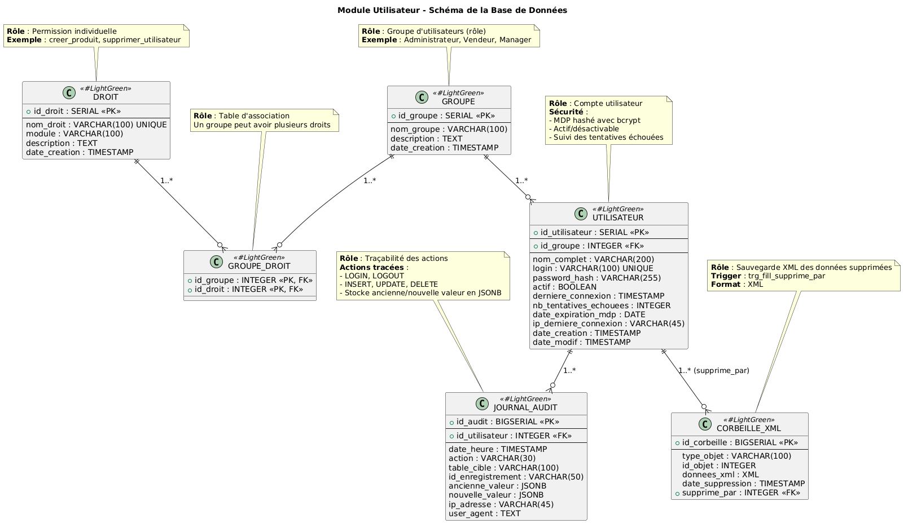
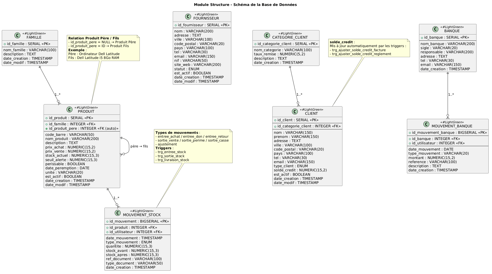
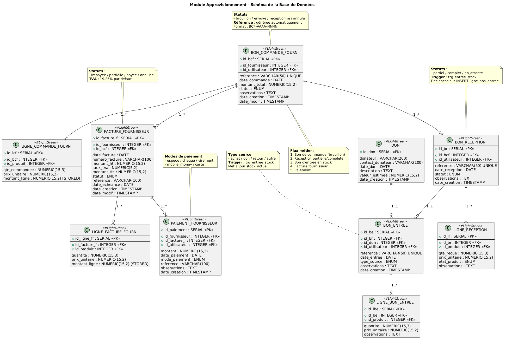
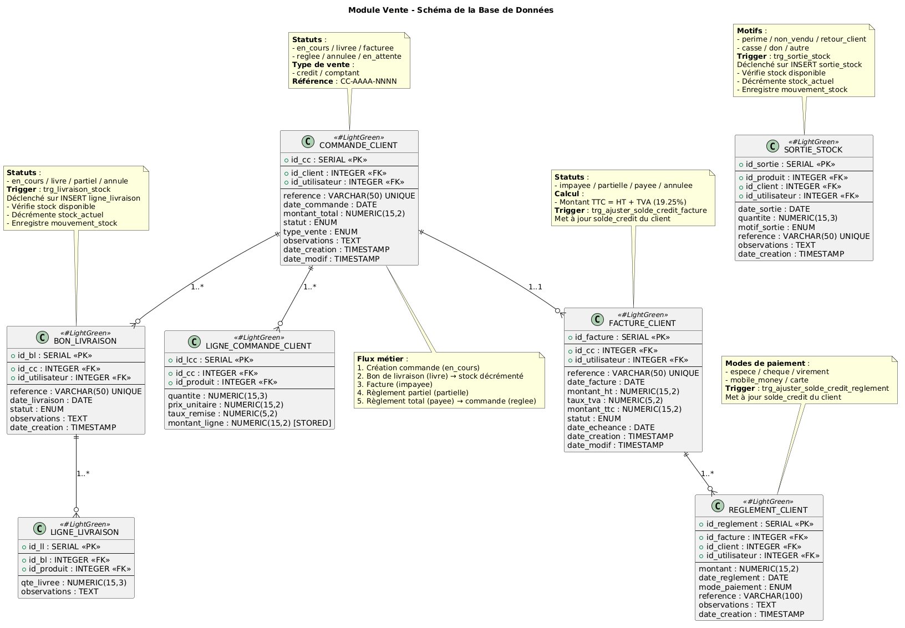
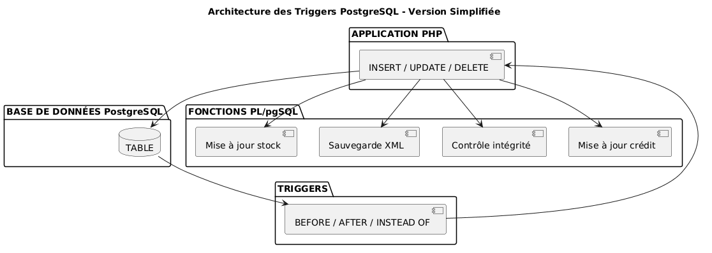

REPUBLIQUE DU CAMEROUN

REPUBLIC OF CAMEROON

PEACE - WORK - FATHERLAND

Paix - Travail - Patrie

UNIVERSITE DE DSCHANG

UNIVERSITY OF DSCHANG

INSTITUT UNIVERSITAIRE DE TECHNOLOGIE FOTSO VICTOR DE BANDJOUN

FOTSO VICTOR INSTITUTE OF TECHNOLOGY

Département **Génie Informatique**

*Department of **Computer Engineering***

{width=1.1in}

# GROUPE 7: RAPPORT TECHNITQUE ET GUIDE D'INSTALLATION DU PROJET DE BDE ET LTW

## Application web de gestion de stock

**Membres du projet**

| Noms et prénoms | Filière | Numéro de groupe |
|---|---|---|
| NGUEDIA FOKAM Roman Aris | CDRI | 25 |
| KENYIM TIOTSOP Freshnel | CDRI | 25 |
| NZOCK KAPOKO Chris Valdo | QSIR | 25 |
| KAMENI TCHOUKAM POUTCHEU Styve Landry | CDRI | 26 |
| MOUTHE Gerald Cabriel | QSIR | 26 |
| DONGMEZA NANKIA Leslie | QSIR | 26 |
| GOUONGO TUEKAM Jules Rodrigue | CDRI | 27 |
| ASOBO HARRIS | CDRI | 27 |
| MADJO TALLA Ornella | QSIR | 27 |
| FEUDJO ARCHILE AURLUCE | CDRI | 28 |
| ABDOULASIR MOUHAMADOU | CDRI | 28 |
| MOUALEU SADO MELICIA CHARNELLE | QSIR | 28 |

Sous la supervision de

**Dr. NOULAMO Thierry**

**ANNEE ACADEMIQUE 2025/2026**

\newpage

## Table des matières

- [INTRODUCTION](#introduction)
- [1. Contexte du projet](#1-contexte-du-projet)
- [2. Objectifs du projet](#2-objectifs-du-projet)
- [3. Périmètre du projet](#3-périmètre-du-projet)
- [4. Mini cahier des charges](#4-mini-cahier-des-charges)
- [5. Présentation de l'application](#5-présentation-de-lapplication)
- [6. Architecture technique](#6-architecture-technique)
- [7. Modèle de données](#7-modèle-de-données)
- [8. Mécanismes avancés de base de données](#8-mécanismes-avancés-de-base-de-données)
- [9. Modules développés](#9-modules-développés)
- [10. Interface utilisateur et design system](#10-interface-utilisateur-et-design-system)
- [11. Sécurité et contrôle d'accès](#11-sécurité-et-contrôle-daccès)
- [12. Tests et validation](#12-tests-et-validation)
- [13. Installation et exploitation](#13-installation-et-exploitation)
- [CONCLUSION](#conclusion)
- [ANNEXES](#annexes)

\newpage

# INTRODUCTION

Le présent projet consiste à développer une application web de gestion de stock complète, répondant aux besoins d'une entreprise commerciale. L'objectif principal est de fournir un outil fonctionnel, sécurisé et ergonomique permettant de gérer l'ensemble du cycle de vie des produits : depuis les approvisionnements auprès des fournisseurs jusqu'à la vente aux clients, en passant par la gestion du référentiel, le suivi des mouvements de stock, la facturation et le contrôle des accès utilisateurs.

L'application a été conçue autour d'une base de données PostgreSQL structurée en plusieurs schémas fonctionnels. Elle s'appuie sur une architecture MVC légère en PHP, une interface responsive basée sur TailwindCSS et des mécanismes avancés de base de données, notamment les triggers, l'audit et la sauvegarde XML des éléments supprimés.

## 1. Contexte du projet

La gestion manuelle des stocks expose une entreprise à plusieurs difficultés : erreurs de saisie, perte de traçabilité, absence de suivi en temps réel, confusion entre les opérations d'achat et de vente, mauvaise maîtrise des crédits clients et accès non contrôlés aux données sensibles. Le projet vise donc à digitaliser ces processus dans une application centralisée.

L'application permet de gérer les produits, les familles, les fournisseurs, les clients, les banques, les commandes fournisseurs, les réceptions, les bons d'entrée, les commandes clients, les livraisons, les factures, les règlements et les utilisateurs. Elle garantit également une traçabilité via un journal d'audit et une corbeille XML.

## 2. Objectifs du projet

| Objectif | Description |
|---|---|
| Automatisation | Digitaliser et automatiser les processus de gestion de stock |
| Traçabilité | Assurer le suivi complet des produits, documents et transactions |
| Sécurité | Mettre en place l'authentification et le contrôle d'accès par droits |
| Fiabilité | Garantir l'intégrité des données via des contraintes et triggers |
| Ergonomie | Offrir une interface claire, responsive et adaptée aux utilisateurs |
| Exploitation | Produire des états, reçus, factures, bons et tableaux de bord |

## 3. Périmètre du projet

L'application couvre quatre modules fonctionnels principaux :

- **Module 1 : Gestion des approvisionnements** : commandes fournisseurs, réceptions, dons, bons d'entrée, factures fournisseurs, paiements fournisseurs et états d'achats.
- **Module 2 : Gestion des ventes** : commandes clients, bons de livraison, factures clients, règlements clients, sorties de stock, vente au comptant et états de ventes.
- **Module 3 : Gestion de la structure** : familles, produits, fournisseurs, clients, catégories clients, banques, mouvements bancaires et corbeille XML.
- **Module 4 : Gestion des utilisateurs** : authentification, groupes, droits, utilisateurs, profil et journal d'audit.

Des modules transverses complètent le périmètre : tableau de bord, recherche globale, impressions, design system et restauration des éléments supprimés.

## 4. Mini cahier des charges

### 4.1 Acteurs du système

| Acteur | Rôle dans le système |
|---|---|
| Administrateur | Gère les utilisateurs, groupes, droits, journal d'audit et corbeille |
| Gestionnaire de stock | Suit les produits, entrées, sorties et alertes de stock |
| Responsable achats | Gère les fournisseurs, commandes, réceptions, factures et paiements fournisseurs |
| Responsable ventes | Gère les commandes clients, livraisons, factures et règlements |
| Caissier | Enregistre les ventes au comptant et règlements clients |
| Auditeur | Consulte les états, tableaux de bord et journaux sans modifier les données |

### 4.2 Besoins fonctionnels

| Besoin | Description |
|---|---|
| Gestion du référentiel | Créer et maintenir produits, familles, fournisseurs, clients, catégories et banques |
| Gestion des approvisionnements | Suivre les commandes fournisseurs, réceptions, bons d'entrée, factures et paiements |
| Gestion des ventes | Gérer commandes clients, livraisons, factures, règlements et ventes au comptant |
| Suivi du stock | Mettre à jour automatiquement le stock lors des entrées et sorties |
| Sécurité | Authentifier les utilisateurs et contrôler les actions par droits |
| Traçabilité | Enregistrer les actions critiques dans un journal d'audit |
| Restauration | Sauvegarder certains objets supprimés dans une corbeille XML |
| Reporting | Produire tableaux de bord, états, reçus, factures, bons et tickets imprimables |

### 4.3 Contraintes techniques

| Contrainte | Choix retenu |
|---|---|
| Application web légère | PHP sans framework lourd |
| Base relationnelle robuste | PostgreSQL avec schémas séparés |
| Intégrité du stock | Triggers PostgreSQL et contrôle du stock négatif |
| Sécurité des accès | Sessions PHP et RBAC |
| Interface responsive | TailwindCSS, composants réutilisables et JavaScript natif |
| Impression documentaire | Vues dédiées pour factures, bons, reçus, tickets et états |
| Maintenabilité | Organisation MVC, contrôleurs, modèles et vues séparés |

### 4.4 Diagramme de flux global

Le cycle métier général de l'application peut être résumé ainsi :

```text
Fournisseur
    ↓
Commande fournisseur
    ↓
Réception
    ↓
Bon d'entrée
    ↓
Stock
    ↓
Commande client / Vente au comptant
    ↓
Livraison / Sortie de stock
    ↓
Facture client
    ↓
Règlement client
    ↓
États, audit et tableaux de bord
```

Ce flux montre que le stock est le point central de l'application. Les approvisionnements alimentent le stock via les bons d'entrée, tandis que les ventes et sorties diminuent le stock via les livraisons ou sorties directes. La facturation et les règlements assurent le suivi financier.

## 5. Présentation de l'application

### 5.1 Description fonctionnelle

L'application Gestion Stock est une solution web permettant de :

- gérer un catalogue de produits avec familles et hiérarchie père/fils ;
- suivre le stock en temps réel ;
- contrôler les entrées et sorties de stock ;
- gérer les achats auprès des fournisseurs ;
- gérer les ventes aux clients ;
- suivre les factures, paiements et crédits clients ;
- gérer les banques et mouvements financiers ;
- administrer les utilisateurs et leurs droits d'accès ;
- imprimer les documents opérationnels ;
- assurer la traçabilité via un journal d'audit ;
- sauvegarder automatiquement certaines données supprimées en XML.

### 5.2 Technologies utilisées

| Technologie | Version indicative | Rôle |
|---|---:|---|
| PHP | 8.0+ | Langage backend principal |
| PostgreSQL | 13+ | Système de gestion de base de données |
| PDO | Extension PHP | Accès aux données par requêtes préparées |
| TailwindCSS | 3.4 | Framework CSS |
| JavaScript | Vanilla JS | Interactions frontend |
| FontAwesome | 7.x | Icônes |
| Chart.js | 4.x | Graphiques |
| Composer | Optionnel | Autoload PSR-4 |
| npm | Node.js | Compilation des assets frontend |
| Git/GitHub | -- | Versionnement et collaboration |

### 5.3 Structure du projet

```text
gestion_stock/
├── api/                         Endpoints internes
├── config/                      Configuration, session et fonctions globales
├── controllers/                 Contrôleurs MVC
├── database/                    Scripts SQL et données de test
├── diagram_&_model/             Diagrammes MCD, MLD, classes et séquences
├── docs/                        Documentation projet
├── models/                      Modèles d'accès aux données
├── public/                      Assets CSS, JS et librairies publiques
├── src/                         Services et classes PSR-4
├── views/                       Vues PHP, composants, layouts et impressions
├── index.php                    Routeur principal
├── composer.json                Déclaration Composer
├── package.json                 Dépendances frontend
└── tailwind.config.js           Configuration TailwindCSS
```

### 5.4 Architecture MVC

Le projet suit une architecture MVC légère :

| Couche | Rôle | Exemples |
|---|---|---|
| Routeur | Analyse l'action demandée et appelle le contrôleur | `index.php` |
| Contrôleurs | Vérifient les droits, traitent les requêtes et chargent les vues | `VenteController`, `ApprovisionnementController` |
| Modèles | Encapsulent les requêtes SQL et transactions | `ProduitModel`, `ReceptionModel`, `FactureClientModel` |
| Vues | Génèrent les interfaces et documents imprimables | `views/vente`, `views/approvisionnement` |
| Composants | Mutualisent les éléments UI | `renderButton`, `renderTable`, `renderModal` |

### 5.5 Flux de traitement d'une requête

1. L'utilisateur effectue une action depuis le navigateur.
2. `index.php` lit le paramètre `action`.
3. Le routeur vérifie que l'utilisateur est connecté.
4. Le contrôleur correspondant est instancié.
5. Le contrôleur vérifie les droits avec `checkRight()`.
6. Les modèles exécutent les requêtes SQL via PDO.
7. Le contrôleur prépare les données.
8. La vue génère le HTML ou le document imprimable.
9. Les actions importantes sont journalisées.

## 6. Architecture technique

### 6.1 Backend

| Élément | Description |
|---|---|
| Langage | PHP avec programmation procédurale et orientée objet |
| Accès données | PDO PostgreSQL |
| Sessions | Sessions PHP natives |
| Sécurité | Mots de passe hashés, contrôle des droits, échappement HTML |
| Audit | Fonction `logAudit()` et table `utilisateur.journal_audit` |

### 6.2 Frontend

| Élément | Description |
|---|---|
| CSS | TailwindCSS compilé vers `public/css/main.min.css` |
| JavaScript | `public/js/main.js`, interactions via attributs `data-*` |
| Responsive | Sidebar mobile, tables adaptatives, modales, toasts |
| Design system | Composants PHP réutilisables dans `views/components/` |

### 6.3 Base de données

| Schéma | Tables principales | Rôle |
|---|---:|---|
| `utilisateur` | 6+ | Utilisateurs, groupes, droits, audit, corbeille XML |
| `structure` | 8+ | Référentiel, produits, clients, fournisseurs, banques, stock |
| `approvisionnement` | 10 | Achats, commandes, réceptions, entrées, factures, paiements |
| `vente` | 7 | Commandes clients, livraisons, factures, règlements, sorties |

## 7. Modèle de données

### 7.1 Schéma utilisateur

{width=5.8in}

Ce schéma regroupe les entités liées à l'authentification, au contrôle d'accès et à la traçabilité : groupes, droits, utilisateurs, journal d'audit et corbeille XML.

### 7.2 Schéma structure

{width=5.8in}

Ce schéma constitue le référentiel de l'application : familles, produits, fournisseurs, clients, catégories clients, banques et mouvements de stock.

### 7.3 Schéma approvisionnement

{width=5.8in}

Ce schéma couvre le cycle d'achat : commande fournisseur, réception, bon d'entrée, facture fournisseur et paiement fournisseur.

### 7.4 Schéma vente

{width=5.2in}

Ce schéma couvre le cycle de vente : commande client, livraison, facturation, règlement et sorties de stock.

## 8. Mécanismes avancés de base de données

### 8.1 Principe des triggers PostgreSQL

Les triggers automatisent des traitements critiques directement dans la base de données. Ils garantissent la cohérence du stock et la traçabilité même si plusieurs parties de l'application manipulent les mêmes tables.

{width=5.8in}

### 8.2 Triggers de stock

| Trigger | Table | Événement | Rôle |
|---|---|---|---|
| `trg_entree_stock` | `approvisionnement.ligne_bon_entree` | AFTER INSERT/UPDATE | Augmente le stock et écrit un mouvement |
| `trg_livraison_stock` | `vente.ligne_livraison` | AFTER INSERT/UPDATE | Diminue le stock lors d'une livraison |
| `trg_sortie_stock` | `vente.sortie_stock` | AFTER INSERT/UPDATE | Diminue le stock hors vente |
| `trg_controle_stock` | `structure.produit` | BEFORE UPDATE | Interdit le stock négatif |

Ces triggers empêchent les incohérences de stock. Par exemple, une livraison vérifie la quantité disponible, décrémente automatiquement le stock et crée un enregistrement dans `structure.mouvement_stock`.

### 8.3 Sauvegarde XML et corbeille

La corbeille XML sauvegarde certains objets avant suppression. Les triggers construisent un document XML contenant les données supprimées, puis l'insèrent dans `utilisateur.corbeille_xml`. Le module de restauration lit ce XML, vérifie les contraintes nécessaires et réinsère les données lorsque c'est possible.

Objets concernés :

- produits ;
- fournisseurs ;
- utilisateurs ;
- groupes ;
- commandes fournisseurs ;
- commandes clients ;
- mouvements bancaires.

### 8.4 Crédit client

Les triggers `trg_ajuster_solde_credit_facture` et `trg_ajuster_solde_credit_reglement` mettent à jour le solde crédit client à partir des factures et règlements. Une facture impayée ou partielle augmente le crédit dû, tandis qu'un règlement le diminue.

### 8.5 Synthèse des mécanismes

| Mécanisme | Bénéfice |
|---|---|
| Triggers de stock | Cohérence entre documents et stock courant |
| Mouvement de stock | Historique détaillé des entrées et sorties |
| Journal d'audit | Traçabilité des actions utilisateur |
| Corbeille XML | Possibilité de restauration après suppression |
| Crédit client automatique | Suivi fiable des montants dus |

## 9. Modules développés

### 9.1 Module 1 - Gestion des approvisionnements

| Élément | Détail |
|---|---|
| Contrôleur | `ApprovisionnementController` |
| Modèles | `BonCommandeModel`, `ReceptionModel`, `DonModel`, `BonEntreeModel`, `FactureFournisseurModel`, `PaiementFournisseurModel` |
| Vues | `views/approvisionnement/` |
| Tables | `approvisionnement.*`, `structure.produit`, `structure.fournisseur` |

Fonctionnalités :

- création, modification, validation, annulation et impression des commandes fournisseurs ;
- enregistrement des réceptions liées ou non à une commande ;
- validation des réceptions avec génération automatique de bons d'entrée ;
- enregistrement des dons avec entrée en stock ;
- consultation et impression des bons d'entrée ;
- saisie des factures fournisseurs ;
- enregistrement des paiements fournisseurs ;
- états journaliers et annuels des achats.

Règles métier principales :

- une commande fournisseur doit contenir au moins une ligne produit ;
- une réception liée à une commande ne peut pas dépasser les quantités commandées ;
- une réception validée génère un bon d'entrée ;
- les lignes de bon d'entrée déclenchent l'augmentation du stock ;
- une facture fournisseur liée à des paiements ne doit pas être supprimée sans contrôle.

**Capture d'écran de la gestion des commandes fournisseurs**

### 9.2 Module 2 - Gestion des ventes

| Élément | Détail |
|---|---|
| Contrôleur | `VenteController` |
| Modèles | `CommandeClientModel`, `BonLivraisonModel`, `FactureClientModel`, `ReglementClientModel`, `SortieStockModel` |
| Vues | `views/vente/` |
| Tables | `vente.*`, `structure.client`, `structure.produit` |

Fonctionnalités :

- commandes clients avec lignes produits ;
- bons de livraison partiels ou complets ;
- factures clients créées depuis les commandes livrées ;
- règlements clients partiels ou totaux ;
- sorties de stock hors vente ;
- vente au comptant en transaction unique ;
- dashboard ventes ;
- états journaliers et annuels des ventes ;
- impressions des bons, factures, reçus et tickets.

Règles métier principales :

- une commande client doit contenir au moins une ligne produit ;
- une livraison diminue le stock via trigger ;
- une facture client est générée à partir d'une commande livrée ;
- les règlements recalculent le statut de la facture ;
- la vente au comptant crée commande, livraison, facture et règlement dans une seule transaction ;
- une sortie de stock est bloquée si la quantité disponible est insuffisante.

**Capture d'écran du dashboard des ventes**

**Capture d'écran de la facture client**

### 9.3 Module 3 - Gestion de la structure

| Élément | Détail |
|---|---|
| Contrôleurs | `FamilleController`, `ProduitController`, `FournisseurController`, `ClientController`, `CategorieClientController`, `BanqueController`, `RestaurationController` |
| Modèles | `FamilleModel`, `ProduitModel`, `FournisseurModel`, `ClientModel`, `CategorieClientModel`, `BanqueModel`, `MouvementBanqueModel`, `RestaurationModel` |
| Vues | `views/structure/` |
| Tables | `structure.*`, `utilisateur.corbeille_xml` |

Fonctionnalités :

- CRUD des familles ;
- CRUD des produits avec famille, prix, stock, seuil et statut actif ;
- gestion des fournisseurs avec activation/désactivation ;
- gestion des clients et catégories clients ;
- suivi du crédit client ;
- gestion des banques ;
- enregistrement de mouvements bancaires ;
- consultation des états bancaires par période ;
- consultation, restauration et vidage de la corbeille XML.

Règles métier principales :

- les noms des entités principales sont obligatoires ;
- une catégorie liée à des clients ne doit pas être supprimée ;
- les produits inactifs sont retirés des listes opérationnelles ;
- les banques exigent un nom ;
- les mouvements bancaires exigent une banque et un montant positif ;
- la restauration depuis la corbeille dépend de la cohérence des dépendances.

**Capture d'écran de la liste des produits**

**Capture d'écran de l'état des versements bancaires**

### 9.4 Module 4 - Gestion des utilisateurs

| Élément | Détail |
|---|---|
| Contrôleur | `UtilisateurController`, `AuthController` |
| Modèles | `UtilisateurModel`, `GroupeModel`, `DroitModel`, `JournalAuditModel` |
| Vues | `views/auth/`, `views/utilisateur/` |
| Tables | `utilisateur.utilisateur`, `utilisateur.groupe`, `utilisateur.droit`, `utilisateur.groupe_droit`, `utilisateur.journal_audit` |

Fonctionnalités :

- connexion et déconnexion ;
- création, modification et suppression des groupes ;
- consultation et affectation des droits ;
- création, modification et suppression des utilisateurs ;
- activation/désactivation de comptes ;
- modification du mot de passe depuis le profil ;
- consultation paginée du journal d'audit.

Règles métier principales :

- un utilisateur doit appartenir à un groupe ;
- un groupe contenant des utilisateurs ne doit pas être supprimé ;
- un utilisateur ne peut pas supprimer son propre compte ;
- un compte inactif ne peut pas accéder à l'application ;
- les actions critiques sont journalisées.

**Capture d'écran de la gestion des utilisateurs**

**Capture d'écran de la gestion des droits**

### 9.5 Modules transverses

| Module | Description |
|---|---|
| Tableau de bord | KPIs, graphiques, stocks bas, activité récente |
| Recherche globale | Endpoint `?action=api_search&q=...` |
| Impressions | Bons, factures, reçus, tickets et états |
| Design system | Composants PHP réutilisables |
| Restauration | Corbeille XML et restauration d'objets supprimés |

## 10. Interface utilisateur et design system

### 10.1 Architecture de l'AppShell

L'application est structurée en trois zones :

- une barre latérale de navigation ;
- une barre supérieure avec fil d'Ariane et profil utilisateur ;
- une zone principale de contenu.

La sidebar affiche les sections selon les droits de l'utilisateur : Navigation, Structure, Approvisionnements, Ventes et Utilisateurs.

### 10.2 Composants UI

| Composant | Fonction |
|---|---|
| `renderButton()` | Boutons standards et boutons icônes |
| `renderTable()` | Tableaux HTML |
| `renderResponsiveTable()` | Tableaux adaptatifs mobile/desktop |
| `renderModal()` | Fenêtres modales |
| `renderInput()` | Champs de formulaire |
| `renderSelect()` | Listes déroulantes |
| `renderBadge()` | États et étiquettes |
| `renderEmptyState()` | États vides |
| `renderToastContainer()` | Notifications |

### 10.3 Palette et responsive design

| Élément | Valeur ou comportement |
|---|---|
| Couleur primaire | `#0078D4` |
| Succès | `#43A047` |
| Danger | `#E53935` |
| Avertissement | `#FFA000` |
| Mobile | Sidebar masquée, tables en cartes, modales adaptées |
| Desktop | Sidebar complète et tableaux standards |

## 11. Sécurité et contrôle d'accès

### 11.1 Authentification

L'authentification repose sur :

- la recherche de l'utilisateur par login ;
- la vérification de l'état actif du compte ;
- la vérification du mot de passe avec `password_verify()` ;
- l'ouverture d'une session PHP ;
- la journalisation de la connexion.

### 11.2 Contrôle d'accès RBAC

Chaque utilisateur appartient à un groupe. Les groupes reçoivent des droits via la table `utilisateur.groupe_droit`. Les contrôleurs utilisent `checkRight()` pour bloquer les actions non autorisées et `checkRightIfLogged()` pour masquer certains menus ou boutons.

### 11.3 Protection des données

| Menace | Protection |
|---|---|
| Injections SQL | Requêtes préparées PDO |
| XSS | Échappement avec `htmlspecialchars()` dans les vues |
| Accès non autorisé | Vérification de session et de droits |
| Perte de traçabilité | Journal d'audit |
| Suppression accidentelle | Sauvegarde XML pour certains objets |

### 11.4 Journal d'audit

Toutes les actions critiques sont tracées :

| Action | Informations stockées |
|---|---|
| `LOGIN` | utilisateur, date, IP, navigateur |
| `LOGOUT` | utilisateur et date |
| `INSERT` | table, identifiant, nouvelle valeur |
| `UPDATE` | table, identifiant, anciennes et nouvelles valeurs |
| `DELETE` | table, identifiant, ancienne valeur |

**Capture d'écran du journal d'audit**

## 12. Tests et validation

### 12.1 Tests unitaires

| Module | Tests effectués | Résultat |
|---|---|---|
| Utilisateurs | Connexion, groupes, droits, CRUD utilisateurs | OK |
| Structure | CRUD familles, produits, fournisseurs, clients, banques | OK |
| Approvisionnements | Commandes, réceptions, factures, paiements | OK |
| Ventes | Commandes, livraisons, factures, règlements, vente comptant | OK |

### 12.2 Tests d'intégration

| Test | Résultat |
|---|---|
| Entrée de stock automatique | OK |
| Sortie de stock automatique | OK |
| Sauvegarde XML automatique | OK |
| Mise à jour du crédit client | OK |
| Restauration depuis la corbeille | OK |
| Impression des documents | OK |

### 12.3 Tests de sécurité

| Test | Résultat |
|---|---|
| Accès sans authentification | Bloqué |
| Accès sans droit suffisant | Bloqué |
| Injection SQL simple | Bloqué par requêtes préparées |
| XSS basique | Réduit par échappement HTML |
| Suppression sensible | Confirmation et audit |

## 13. Installation et exploitation

### 13.1 Prérequis

- PHP 8.0 ou supérieur ;
- extension `pdo_pgsql` ;
- PostgreSQL 13 ou supérieur ;
- Node.js et npm ;
- Composer optionnel ;
- serveur Apache, Nginx ou serveur PHP intégré.

### 13.2 Installation

```bash
composer install
npm install
psql -U <utilisateur> -d gestion_stock -f database/gestion_stock_pg.sql
npm run build
php -S localhost:8000
```

### 13.3 Fichiers importants

| Fichier | Rôle |
|---|---|
| `index.php` | Routeur principal |
| `config/database.php` | Connexion PostgreSQL |
| `config/session.php` | Sessions et droits |
| `config/fonctions.php` | Audit et références |
| `database/gestion_stock_pg.sql` | Schéma SQL |
| `public/js/main.js` | Interactions UI |
| `public/css/main.css` | Styles source |

# CONCLUSION

Le projet Système de Gestion des Stocks répond aux exigences fonctionnelles définies dans le cahier des charges. Il couvre les principaux processus d'une entreprise commerciale : approvisionnements, ventes, référentiel, stock, finances, utilisateurs et sécurité.

La réussite du projet repose sur une architecture claire, une base de données structurée, un système de droits, des mécanismes de traçabilité et des triggers PostgreSQL assurant la cohérence des opérations critiques. Les mécanismes avancés tels que l'audit, la sauvegarde XML et la restauration démontrent la maîtrise des concepts de base de données appliqués à un cas réel.

# ANNEXES

## Contributeurs

| Nom | Module | Contributions |
|---|---|---|
| Aurluce | Chef de projet / Module 1 | Architecture, , documentation audit, corbeille XML|
| ArisRoman | Chef de projet / Module 4 | approvisionnements, sécurité, architecture et design systeme |
| Tuekam | Chef de projet / Module 3 | Structure, produits, banques, corbeille |
| Kameni Landry | Chef de projet / Module 2 | Ventes, dashboard, impressions |
